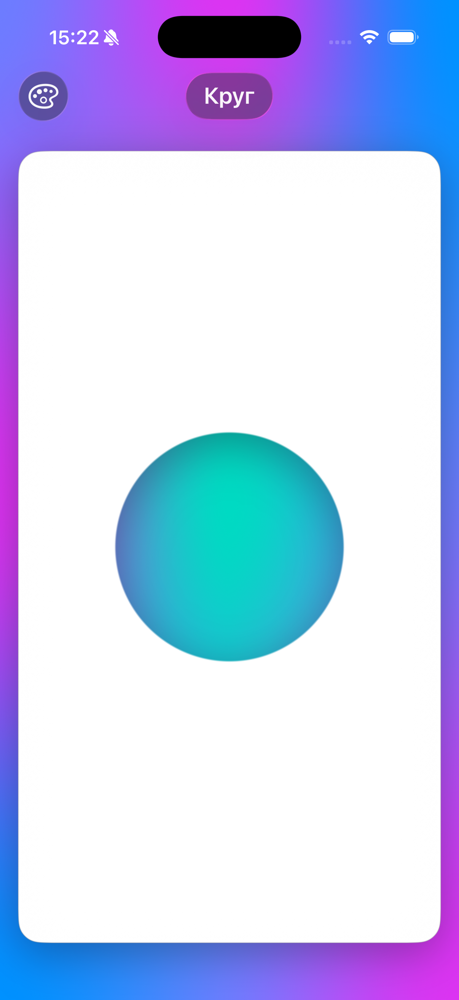
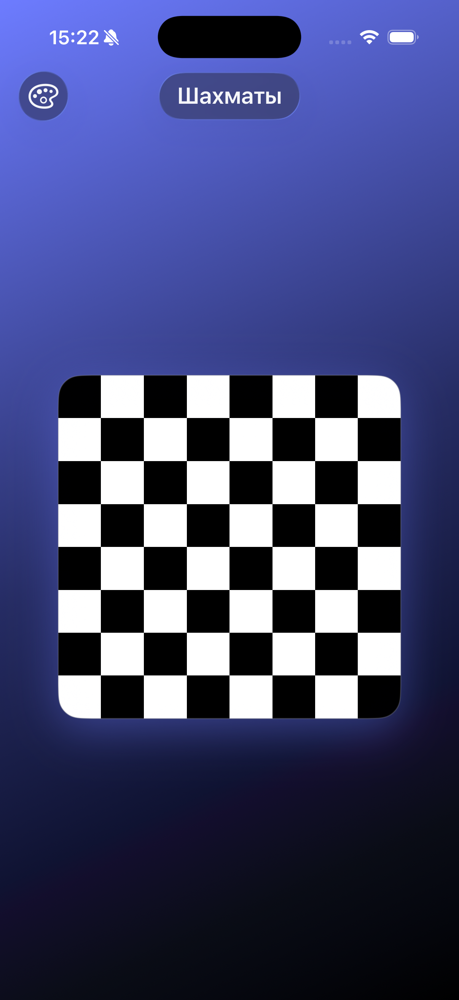
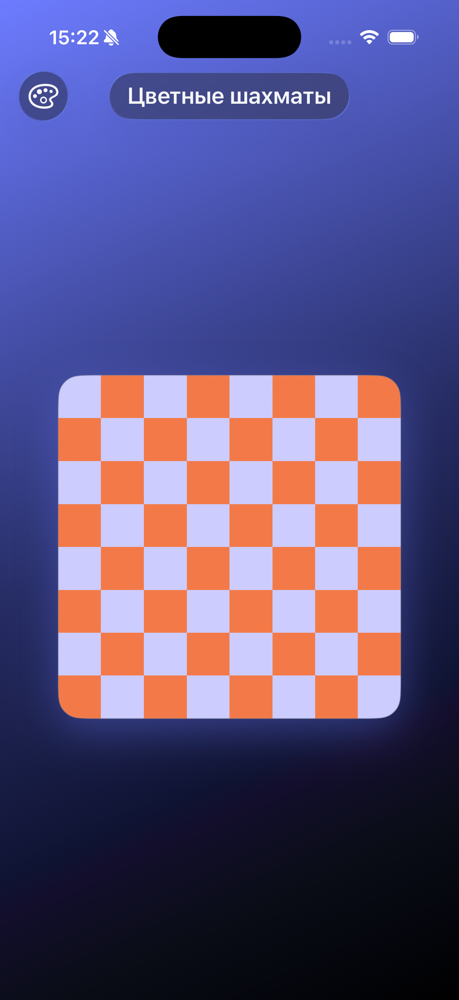
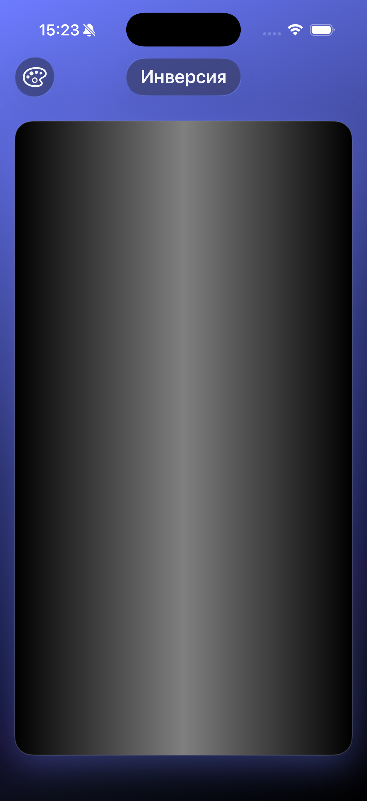
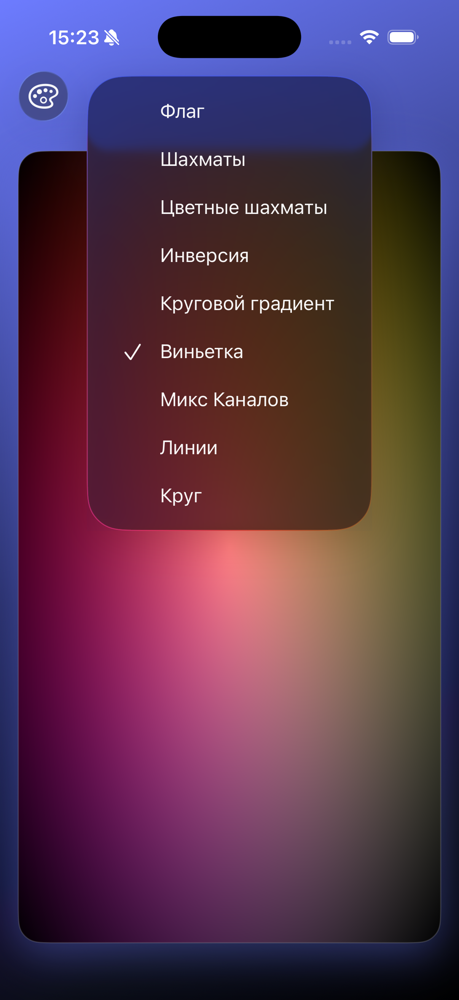

# LearnMetal

A personal sandbox for learning Metal fragment shaders in SwiftUI from scratch — from simple gradients to SDF-based shapes.

The goal isn't to collect ready-made effects, but to build a solid understanding of how a pixel turns into a color. Every shader is written by hand, broken down mathematically, and tested live in a small SwiftUI app. Learning is organized into levels (see [PLAN.md](LearnMetal/PLAN.md), [THEORY.md](LearnMetal/THEORY.md), [TASKS.md](LearnMetal/TASKS.md), [FUNCTIONS.md](LearnMetal/FUNCTIONS.md)): basics first, then shapes, motion, and advanced effects.

Open `LearnMetal.xcodeproj` in Xcode to run it.

 

